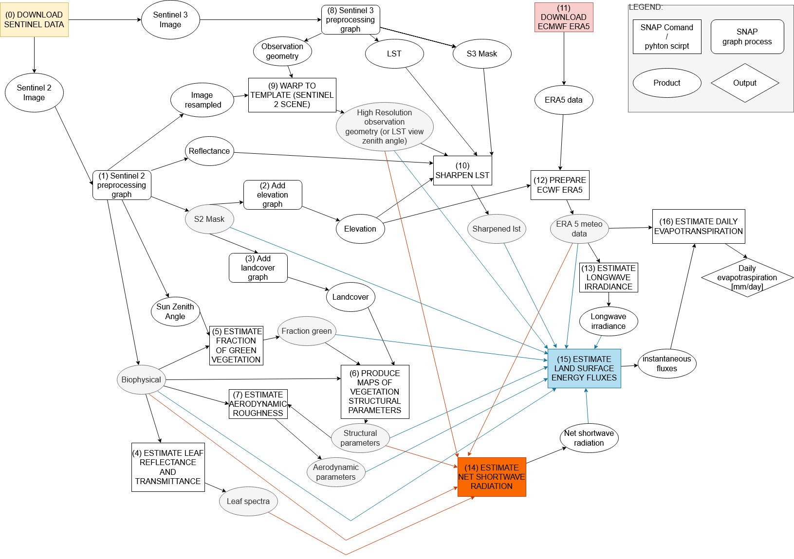
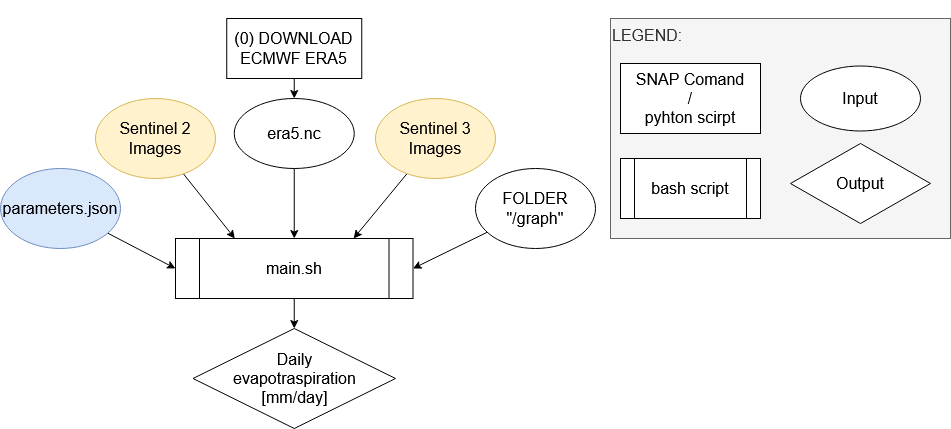

# Automatization of the SEN-et SNAP plugin for multi-temporal analysis
## Description

The [SEN-ET project](https://www.esa-sen4et.org/) has been founded for ESA with the main object to "develop an optimal methodology for estimating evapotranspiration at fine (tens of meters) spatial scale, based on synergistic use of Sentinel 2 and Sentinel 3 satellites’ observations" as reported by the website of the project.

The plugin is mainly thought for use inside SNAP, so a manual operation where the user has to make the different operations manually. However, also the python script for the operation have been released.
The scope of this repository is to create the possibility to automatize the process, allowing the computation of multiple days without the manual input of the operator. So, it is possible to compute monthly means on an area of interest.

The original schema for the plugin is represented in the image below:



The automation process reduces it to one step and presents this schema:



## Installation
It is needed to have installed SNAP (with Python 3.6) and the [SEN-ET plugin](https://www.esa-sen4et.org/static/media/Sen-ET-plugin-v1.0.1.b41ae6c8.zip) as indicated in the [official plugin documentation](https://www.esa-sen4et.org/static/media/sen-et-user-manual-v1.1.0.5d1ac526.pdf) in Section 3.2. In case of troubleshooting, see Section 3.4.

The test that everything is working will be the download of the ERA5 Data in the next step.

It is also needed for Windows computers to install the Git Bash terminal provided with the installation of [Git](https://git-scm.com/downloads).

### Python for generating scripts
For the automatization of the project, it is needed to have python installed on the computer. Also, these libraries are needed:
  - xarray
  - netcdf4
  - h5netcdf

It is possible and recommended to use conda to create and environment with all the dependency with the command:
```
conda env create -f env.yml
```

## Data download
### ECMWF Reanalysis v5 (ERA5) Data
The download of the ERA5 data could be done in multiple ways. The suggested one is with the use of the SEN-ET plugin inside SNAP. This will test that the plugin is correctly working.

For the download, it is needed to have an account for the [Climate Data Store (CDS)](https://cds.climate.copernicus.eu/#!/home) of the Copernicus Climate Change Service. The account could be created for free [here](https://cds.climate.copernicus.eu/user/register).

Then, it is needed to log in to the [page](https://cds.climate.copernicus.eu/api-how-to) and follow the instruction for the API configuration of the CDS. It is needed only to create the file `.cdsapirc` and **NOT** to install the API client using `pip`.

Now, open SNAP and open the function `Download ECMWF ERA5 reanalysis data` at `Optical > Thematical Land Processing > SEN-ET`. Insert the parameters Area of Interest and the first and last date of the analysis period, in the `Processing Parameters` tab, following the instruction and keep all the flags on the element to be downloaded. Finally, insert the path for the download of the file with the data and name it as `era5.nc` and click `Run`.
The processing and the request of the data for one month request around one hour, but it is possible to check the [status](https://cds.climate.copernicus.eu/cdsapp#!/yourrequests) of the request on the CDS.

### Sentinel Images
For the download of the Sentinel Images, it is suggested to use the [Copernicus Open Access Hub](https://scihub.copernicus.eu/dhus/#/home) because most of the images are offline, so not available immediately but only after some hours. 
Create an account [here](https://scihub.copernicus.eu/dhus/#/self-registration), and then it is possible to search the images and start the product retrieval, adding them into the cart.

The images request needs to be of the product type:
- Sentinel 2: `MSIL2A`
- Sentinel 3: `SL_2_LST____`

That option could be added in the filters, zoom to the area of interest and drawn a rectangular in the area. Open the filter panel and add in the sensing date, the timespan of interest for your analysis, and the desired timespan. Using the preview, it is also possible to check the cloud coverage visually.

### Folder structure
Once the data are downloaded, it is needed to organize them in a specific way. An analysis of the data for one month will produce products for around 500 GB. The main folder that could be named as prefered, in the schema below `MAIN_FOLDER`. One folder for each type of data is called `era`, `S2` and `S3`. Inside the `S2` and `S3` folders, a folder for each of the days of the images, the folder should be named in this format `YYYY_MM_DD`.

Once the structure has been created, the `era5.nc` and the images should be moved to the correct folder. Also, it is needed to unzip the images.
As example:
```
MAIN_FOLDER
├───era
│   └  era5.nc
│
├───S2
│   └───2019_08_06
│       ├   S2A_MSIL2A_20190806T095031_N0213_R079_T33TWF_20190806T114240.zip
│       │
│       └───S2A_MSIL2A_20190806T095031_N0213_R079_T33TWF_20190806T114240.SAFE
│           │   INSPIRE.xml
│           │   manifest.safe
│           │   MTD_MSIL2A.xml
│           │
│           ├───AUX_DATA
│           ├───DATASTRIP
│           ├───GRANULE
│           └───rep_info
│
└───S3
    └───2019_08_03
        ├   S3A_SL_2_LST____20190803T083233_20190803T101332_20190804T153249_6059_047_335______LN2_O_NT_003.zip
        │
        └───S3A_SL_2_LST____20190803T083233_20190803T101332_20190804T153249_6059_047_335______LN2_O_NT_003.SEN3
                cartesian_in.nc
                cartesian_tx.nc
                flags_in.nc
                geodetic_in.nc
                geodetic_tx.nc
                geometry_tn.nc
                indices_in.nc
                LST_ancillary_ds.nc
                LST_in.nc
                met_tx.nc
                time_in.nc
                xfdumanifest.xml
```
## Set the parameters
Set the parameters in the file [`parameters.json`](input/parameters.json):
- Set the coordinates of the Area Of Interest (AOI), which could be the portion of the Sentinel 2 images or a bigger area; it is used to cut the Sentinel 3 images and improve the speed of the computation.
- The absolute path indicated by `MAIN_FOLDER` in the previous schema should be inserted in the `general_path` variable. In the example, the `MAIN_FOLDER` absolute path is `"D:\\TEMP\\"`.
- The path into the `setet_folder` variable. The `setet_folder` is something like `"C:\\Users\\user\\.snap\\auxdata\\sen-et-conda-Win64"`.
- It is also possible to modify all the default computational parameters, as explained in Section 3.3 of the official guide. The *only* parameter that should be modified is the [timezone of the area](input/parameters.json#L12).

Finally, copy the absolute path of all the Sentinel Images in the files [`s2_paths.txt`](input/s2_paths.txt) and [`s3_paths.txt`](input/s3_paths.txt). The path should point to the file `MTD_MSIL2A.xml` for S2 and `xfdumanifest.xml` for S3.

## Run the code
### Windows
In conda terminal run: 
```
conda activate senet-auto
main.sh
```
This will open a bash Terminal with all the dependencies correctly installed. 

### Unix system (linux/MacOS)
In a terminal run: 
```
conda activate senet-auto
sh main.sh
```

## Correction of errors
In the [official code repository](https://github.com/DHI-GRAS/sen-et-snap-scripts) the graph presents some errors, due to some changes in the new versions of SNAP. To fix the errors the new version of the graph is present in the folder [graph](graph/).

## Authors
The official code of SNAP is released with [GNU General Public License v3.0](https://github.com/DHI-GRAS/sen-et-snap-scripts/blob/master/LICENSE) by the original authors and as reported in the [plugin code repository](https://github.com/DHI-GRAS/senEtSnapSta).

The code for the automatization of the process is also released by [Lorenzo Stucchi](https://github.com/LorenzoStucchi) with [GNU General Public License v3.0](LICENSE).