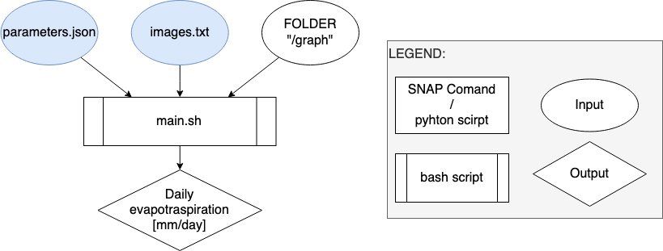

# DIAS Automatization of the SEN-et SNAP plugin for multi-temporal analysis
## Description

The [SEN-ET project](https://www.esa-sen4et.org/) has been founded for ESA with the main object to *"develop an optimal methodology for estimating evapotranspiration at fine (tens of meters) spatial scale, based on synergistic use of Sentinel 2 and Sentinel 3 satellites’ observations"* as reported by the website of the project.

The plugin is mainly thought for use inside SNAP, so a manual operation where the user has to make the different operations manually. However, also the python scripts for the operation have been released.
The scope of this brach of the repository is to have a fully automatize the process, allowing the computation of multiple days without the manual input of the operator, inside a DIAS platform. So, it is possible to compute monthly means on an area of interest.

The original schema for the plugin is represented in the image below:


The dias automation process reduces it to one step and presents this schema:



The whole procedure have been tested on a [CREODIAS](https://creodias.eu/) machine with Ubuntu 18.04.6 LTS. The operation are done using the software [MobaXterm Personal](https://mobaxterm.mobatek.net/download.html) for connecting to the dias.

## Installation for DIAS
### Instal SNAP
To install SNAP it is needed to have installed on the machine OpenJDK, it is possible to install it with

```sh
sudo apt-get install openjdk-11-jre
```

Then it is possible to download the installation script for snap and install it with
```sh
cd /tmp
wget  https://download.esa.int/step/snap/8.0/installers/esa-snap_all_unix_8_0.sh
sudo chmod +x esa-snap_all_unix_8_0.sh
./esa-snap_all_unix_8_0.sh
rm /tmp/esa-snap_all_unix_8_0.sh
cd
```

It is needed to visually launch the snap interface for some passages, it could be done adding some lines in the bash aliases. To modify the file run:
```sh
nano ~/.bash_aliases
```
Then in the file add the two following lines:
```
export PATH=/home/eouser/snap/bin:$PATH
alias snap='/home/eouser/snap/bin/snap'
```
Close and save the file, with `ctrl` + `S` and `ctrl` + `X`.
To then open the graphical interface of snap using the MobaXterm Personal it is sufficient to write in the terminal:
```sh
snap &
```

### Set python in snap with snappy

Snappy requires python version 3.6, for Ubuntu 18.04 LTS it is already present and could be used with the command:
```sh
cd
cd snap/bin
snappy-conf /usr/bin/python3.6
```

#### Extra: install python 3.6

If python version 3.6 is not installed on your machine you could install it using the command:
```sh
sudo apt install python3.6
```
And then do the steps above

### Increase the max RAM usable

The default values of RAM usage from snap could be increased up to the 80-90% to increase the performance. For example for a machine with 32 GB of RAM, 30 could be an accepted value. So this is used as example:

#### for snappy
```sh
sudo nano /home/eouser/.snap/snap-python/snappy/snappy.ini
```
Then modify the file with:
```
java_max_mem: 30G
```
#### for gpt
```sh
sudo nano /home/eouser/snap/bin/gpt.vmoptions
```
Then modify the file with:
```
-Xmx30G
```

### Configuration of the CDS api
Log in to the [page](https://cds.climate.copernicus.eu/api-how-to) and copy the value shows in the section [1](https://cds.climate.copernicus.eu/api-how-to#install-the-cds-api-key). Create the file with the comand

```sh
cd
nano .cdsapirc
```
Then in the file paste the previously copied text that should be in a format like this
```
url: https://cds.climate.copernicus.eu/api/v2
key: {uid}:{api-key}
```

The time needed for processing the request of the data could vary, but it is possible to check the [status](https://cds.climate.copernicus.eu/cdsapp#!/yourrequests) of the request on the CDS.

### Install the sen-et plugin
The sen-et plugin could be downloaded with the following command:
```sh
cd /tmp
wget https://www.esa-sen4et.org/static/media/Sen-ET-plugin-v1.0.1.b41ae6c8.zip
unzip Sen-ET-plugin-v1.0.1.b41ae6c8.zip
```
Then open snap with `snap &` and install the plugin using the graphical interface as indicated in the [official plugin documentation](https://www.esa-sen4et.org/static/media/sen-et-user-manual-v1.1.0.5d1ac526.pdf) in Section 3.2. 

### First lunch of the sen-et plugin
At the first start, it is needed to run an operator to complete the bundle installation as indicated in the documentation:

*The first time any of the Sen-ET operators is run the user will receive a SNAP - Warning message about path not existing. After clicking OK another dialog will appear asking user if they want to proceed with bundle download/installation (Figure 3.4). After clicking "Yes" the download and installation of the plugin bundle (the self-contained Python environment) will happen automatically. When the bundle installation finishes, a message will notify of the successful installation of the bundle. The Sen-ET SNAP plugin is installed and ready for use.*

The installation and the test that everything is working will be done in the step of the download of the ERA5 Data. This will be later explained.

### Download and install the automatization

Download the code in the terminal with
```sh
cd
git clone https://github.com/LorenzoStucchi/SEN-ET_automatization.git
```
The code requires one library that is not already installed that is `shapely`. To install it use
```sh
sudo apt install python3-setuptools
sudo apt install python3-pip
sudo apt install libgeos-dev
pip3 install shapely
```

### PLUS: use screen command

The command `screen` could be very usefull to run the code in a continuous window without the risk of stop the execution due to the disconection from the server.
It could be installed with 
```sh
sudo apt install screen
```
Then before run the code use the comand below to create a new session: 
```sh
screen
```
A guide to use the comand is available [online](https://linuxize.com/post/how-to-use-linux-screen/).

## Prepere the data

### Sentinel Images

The images request needs to be of the product type:
- Sentinel-2: `S2MSI2A`
- Sentinel-3: `SL_2_LST____`

The list of images should be inserted in the file [`images.txt`](input/images.txt), listing before all the Sentinel-2 images and then the Sentinel-3. It is also suggested to ordered them by date.

To obtain the list of images it is useful to use the [CREODIAS finder](https://finder.creodias.eu/), then copy in the file just the name of the images, like in the demo file.

### Parameters
Set the parameters in the file [`parameters.json`](input/parameters.json):
- The path into the `senet_folder` variable. The `senet_folder` is something like `"/home/eouser/.snap/auxdata/sen-et-conda-Linux64"`.
- The temporary path where you want to save intermediate products, that then will be removed, it is suggest to be on a SSD disk, should be indicated in the `temp_files` variable. For example the path is `"/home/eouser/local_data"`.
- The output folder should be indicated in the variable `output_files`, this could be on a object-based storage with unlimited space, it will be access only for writing once and it is not needed to be a fast memory. For the example `"/home/eouser/lstucchi_data/et_maps"`.
- With the flag `remove_temp_files_at_end` it is possible to choose to save space on the machine and remove the intermediate output.
- The flag `time_test` add the option to test the time needed for each step, it could be usefull to test the different steps before lanching a long computation.
- It is also possible to modify all the default computational parameters, as explained in Section 3.3 of the official guide. The *only* parameter that should be modified is the [timezone of the area](input/parameters.json#L10).

## Run the code
In a terminal run: 
```sh
cd SEN-ET_automatization
sh main.sh
```

## Authors
The official code of SNAP is released with [GNU General Public License v3.0](https://github.com/DHI-GRAS/sen-et-snap-scripts/blob/master/LICENSE) by the original authors and as reported in the [plugin code repository](https://github.com/DHI-GRAS/senEtSnapSta).

The code for the automatization of the process is also released by [Lorenzo Stucchi](https://github.com/LorenzoStucchi) with [GNU General Public License v3.0](LICENSE).